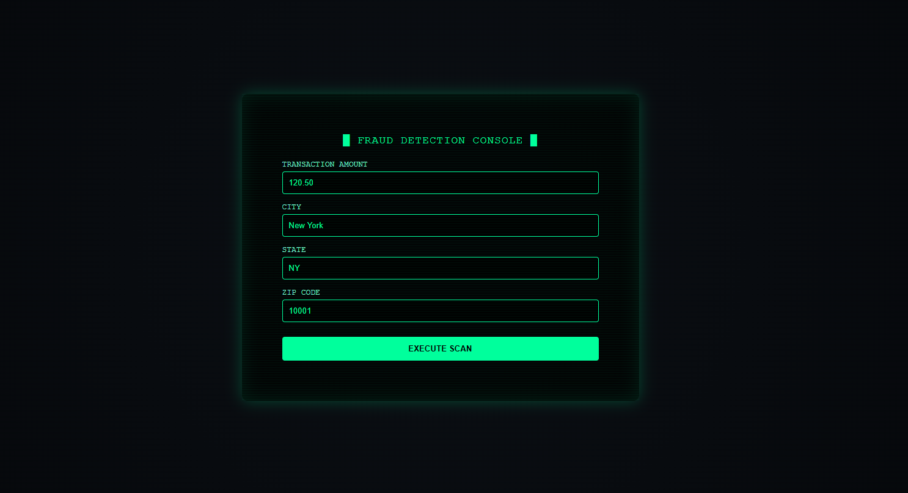
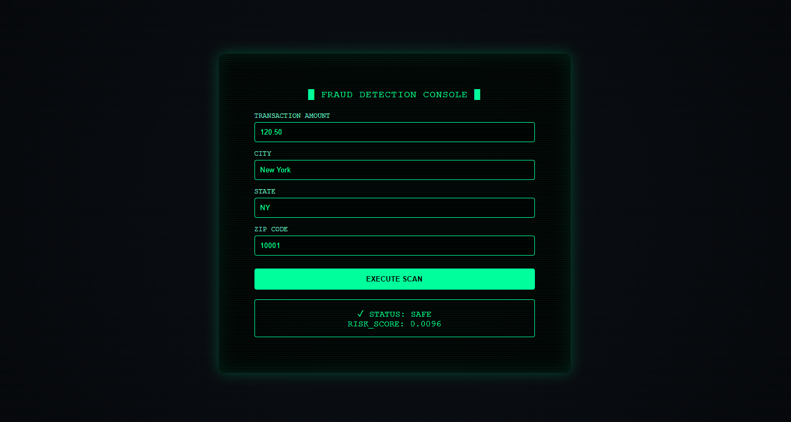
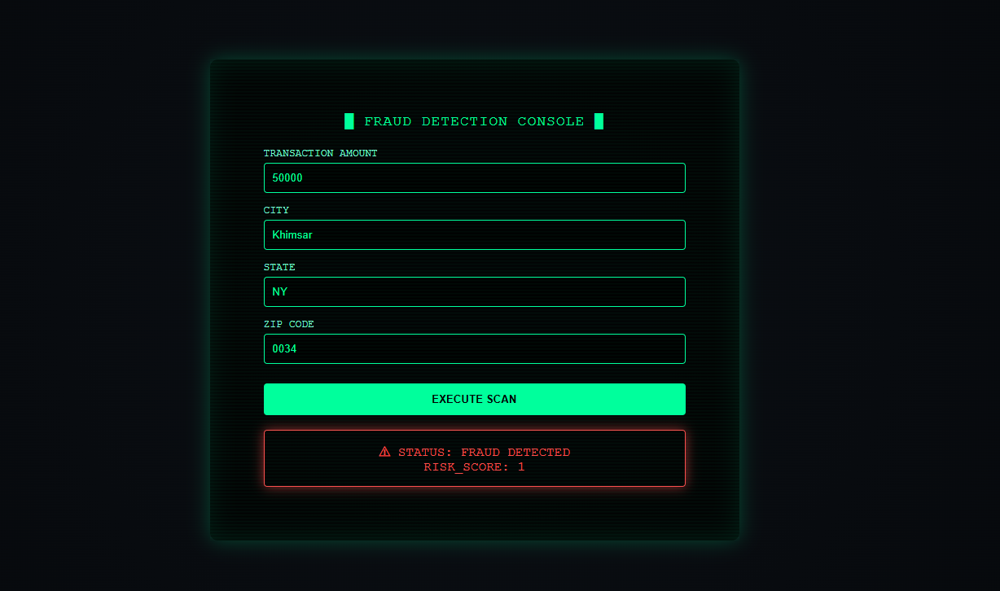

# 💳 Credit Card Fraud Detection System

## 📌 Project Overview

This project is a **Credit Card Fraud Detection System** built using **Machine Learning and FastAPI**, along with an interactive frontend interface.

The machine learning model is **trained externally on Kaggle** using a real-world credit card transactions dataset and is **imported into this project only for inference**. The system predicts whether a given credit card transaction is **fraudulent or legitimate** and displays a **risk score** through an animated scanning interface.

This project demonstrates an **end-to-end machine learning application**, covering model deployment, backend API development, and frontend integration.

---

## 🎯 Objectives

- Detect fraudulent credit card transactions using machine learning  
- Use a pretrained model without retraining locally  
- Deploy the model using a FastAPI backend  
- Connect a frontend interface to a backend API  
- Display predictions with an animated scan and risk score  
- Follow clean coding and GitHub best practices  

---

## 📊 Dataset Information

- Dataset: Credit Card Transactions Fraud Dataset  
- Source: Kaggle  
- Type: Binary classification  
- Nature: Highly imbalanced dataset  

### Target Variable
- `0` → Legitimate transaction  
- `1` → Fraudulent transaction  

---

## ⚙️ Technologies Used

- Python  
- Pandas  
- NumPy  
- Scikit-learn  
- FastAPI  
- Uvicorn  
- HTML  
- CSS  
- JavaScript  
- Git & GitHub  

---

## 🔄 System Workflow

1. The fraud detection model is trained on Kaggle and saved as serialized artifacts.  
2. The FastAPI backend loads the pretrained model and preprocessing objects.  
3. Transaction details are sent to the backend via a REST API.  
4. The model performs inference and returns a fraud prediction with a probability score.  
5. The frontend displays the result using an animated scanning interface.  

## 🖥️ Application Screenshots

### 🔹 Home Screen
User interface for entering transaction details before analysis.

---

### ✅ Legitimate Transaction
Example of a transaction classified as safe with a low risk score.

---

### 🚨 Fraudulent Transaction
Example of a high-risk transaction flagged as fraudulent.

